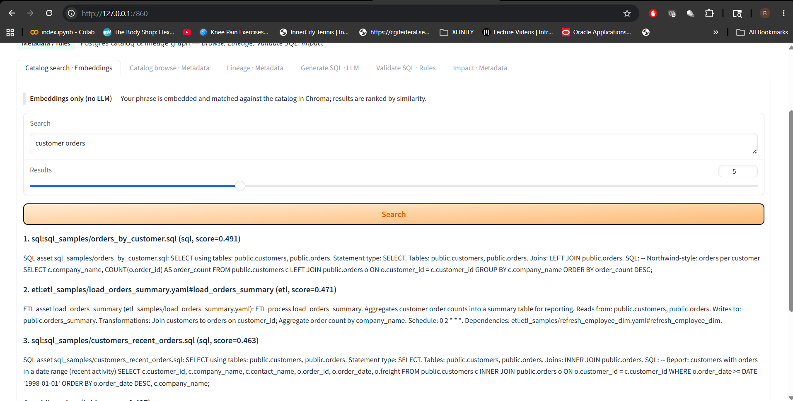
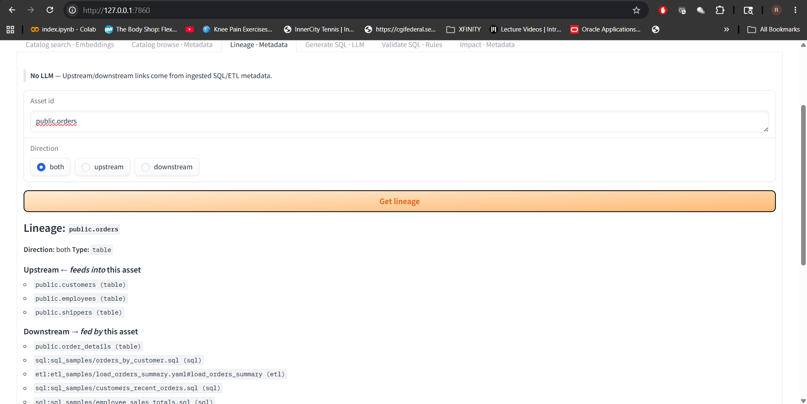
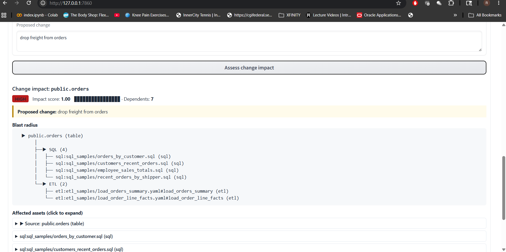
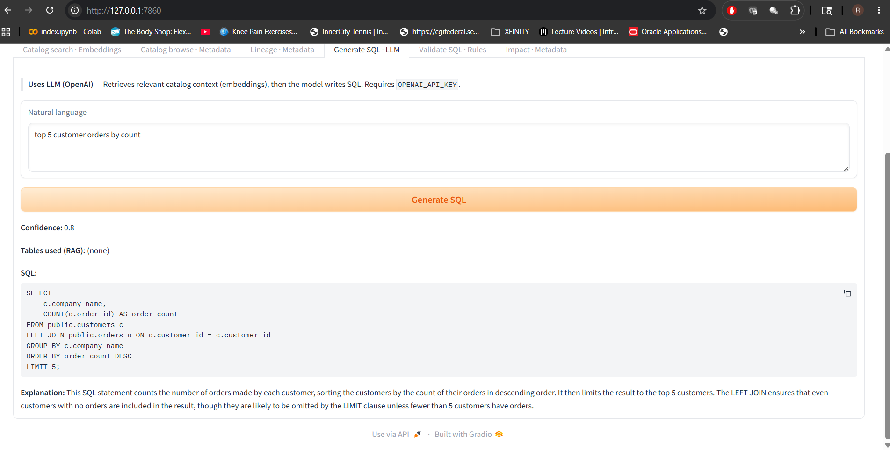
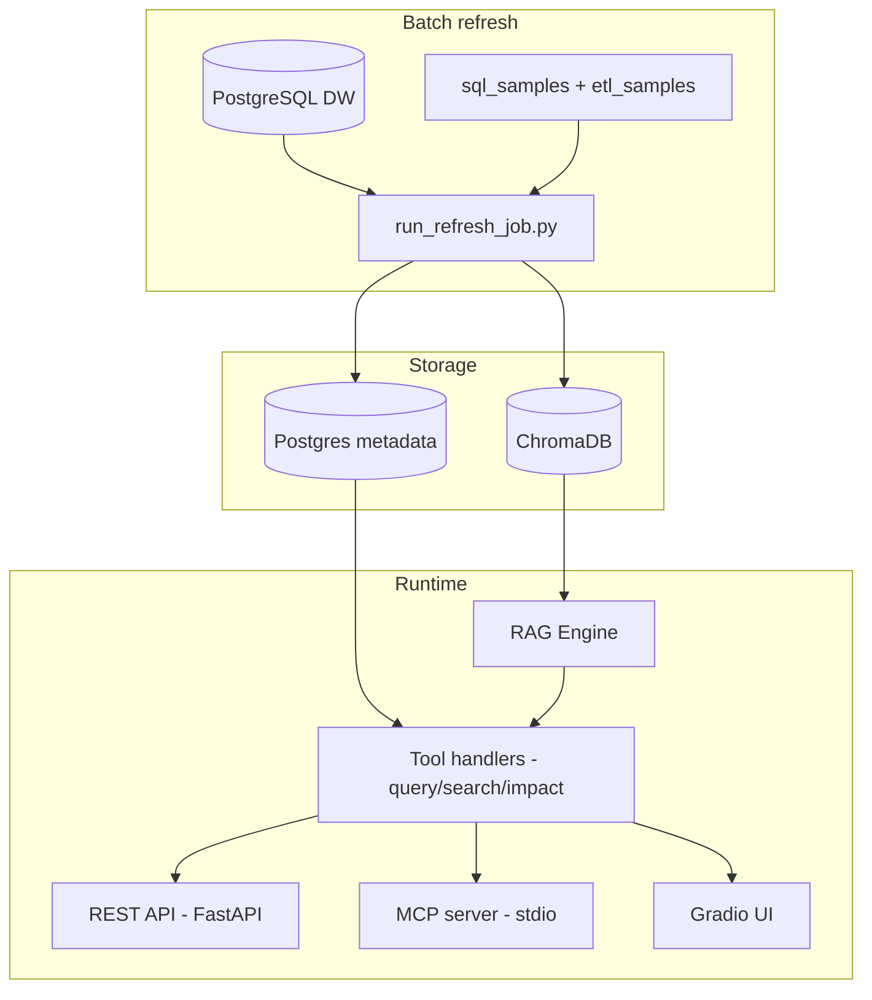

# Data Catalog Assistant

**RAG-based data warehouse intelligence POC** — semantic catalog search, lineage & change-impact analysis, and natural-language SQL generation with a clear split between **LLM**, **embeddings**, and **metadata**.

[](https://github.com/raghuram-chittibomma/data-catalog-assistant/actions/workflows/ci.yml)

> **Portfolio:** [docs/SHOWCASE.md](docs/SHOWCASE.md) · **5-min demo:** [docs/DEMO_SCRIPT.md](docs/DEMO_SCRIPT.md)

---

## Problem

Teams lose time finding tables and SQL, tracing lineage manually, and estimating blast radius before schema changes.

## Solution

Ingest warehouse schema plus SQL/ETL samples into **Chroma** (search) and **Postgres metadata** (lineage/impact). Expose the same capabilities through three interfaces that share one set of tool handlers: a **Gradio UI** (http://127.0.0.1:7860), a **REST API** (FastAPI, http://localhost:3000), and a protocol-compliant **MCP server** (stdio, via the official `mcp` SDK) for agents like Claude Desktop / Cursor. Use **OpenAI only for Generate SQL**, with RAG context from the catalog.

## Screenshots

| Catalog search (embeddings) | Lineage (metadata) |
|:---:|:---:|
|  |  |

| Change impact (metadata) | Generate SQL (LLM + RAG) |
|:---:|:---:|
|  |  |

---

## Architecture



| Component | Path |
|-----------|------|
| Ingestion | `src/data_ingestion/` |
| Vector + metadata | `src/vector_store/` |
| RAG / impact | `src/core/` |
| REST API + MCP server | `src/mcp_server/` (`server.py` REST, `mcp_app.py` MCP) |
| UI | `src/ui/` |
| Refresh | `batch_jobs/run_refresh_job.py` |

---

## Tech stack

| Area | Stack |
|------|--------|
| Runtime | Python 3.10+, conda env `ai-dev` recommended |
| Warehouse | PostgreSQL (Northwind-style sample) |
| Catalog / lineage | PostgreSQL database `bdw_rag_metadata` |
| Vectors | ChromaDB, `sentence-transformers` (`all-MiniLM-L6-v2`) |
| LLM | OpenAI (GPT-4) — NL→SQL only |
| REST API | FastAPI, Uvicorn |
| MCP | Official `mcp` Python SDK (stdio) |
| UI | Gradio 4.x |
| Tests | pytest (~105 tests), ruff lint + coverage gate in CI |

---

## Design decisions

- **Embeddings for search, graph for lineage** — Similarity in Chroma; upstream/downstream and impact scores in Postgres.
- **LLM only where needed** — Generate SQL uses RAG + OpenAI; impact and lineage stay deterministic for demos.
- **One tool layer, three interfaces** — the same query/search/impact handlers back the Gradio UI, the REST API, and the MCP server, so behavior never drifts between them.
- **Change text drives target table** — Assess change impact parses `on public.customers` even if Asset id still says `public.orders`.
- **SQL validation** — Rule-based checks on generated SQL before display.

Details: [docs/SHOWCASE.md](docs/SHOWCASE.md)

---

## Quick start

### Prerequisites

- Python 3.10+
- PostgreSQL (data warehouse + metadata DB)
- [OpenAI API key](https://platform.openai.com/) (only for **Generate SQL** tab)
- Conda env with dependencies installed (`pip install -r requirements.txt`)

### Setup

```powershell
conda activate ai-dev
cd path\to\data-catalog-assistant

copy .env.example .env
# Edit .env: DW_HOST, DW_USER, DW_PASSWORD, METADATA_DB_HOST, METADATA_DB_*, OPENAI_API_KEY
```

### Refresh catalog (required once)

```powershell
python batch_jobs\run_refresh_job.py
```

Expect ~16 vector documents and lineage relationships in metadata (varies with samples).

### Run application

```powershell
# Gradio UI + REST API
python src\main.py

# Protocol-compliant MCP server (stdio) for agents
python -m src.mcp_server.mcp_app
```

| Interface | Endpoint | Use |
|-----------|----------|-----|
| Gradio UI | http://127.0.0.1:7860 | Interactive demo |
| REST API | http://localhost:3000 | HTTP / curl |
| MCP server | stdio (`python -m src.mcp_server.mcp_app`) | Claude Desktop, Cursor, other MCP clients |

See [docs/SETUP_GUIDE.md](docs/SETUP_GUIDE.md) for an example MCP client config.

**Note:** Overnight scheduler is **off** by default (`schedule_on_startup: false`). Refresh the catalog with `run_refresh_job.py` (or cron), not via a background loop in `main.py`.

---

## What uses AI in the UI

| Tab | Technology |
|-----|------------|
| Catalog search · Embeddings | Chroma — no chat LLM |
| Catalog browse / Lineage / Impact · Metadata | Postgres lineage — no LLM |
| Validate SQL · Rules | Pattern checks — no LLM |
| Generate SQL · LLM | OpenAI + RAG catalog context |

---

## Tests

```powershell
pytest tests/ -q
pytest tests/ --cov=src
ruff check .          # lint
ruff format --check . # formatting
```

CI runs **two jobs** on push (see `.github/workflows/ci.yml`): a `lint` job (`ruff check` + `ruff format --check`) and a `test` job (pytest with a 60% coverage floor). Badge links to [github.com/raghuram-chittibomma/data-catalog-assistant](https://github.com/raghuram-chittibomma/data-catalog-assistant).

---

## Documentation

| Document | Description |
|----------|-------------|
| [docs/SHOWCASE.md](docs/SHOWCASE.md) | Resume / interview one-pager |
| [docs/DEMO_SCRIPT.md](docs/DEMO_SCRIPT.md) | Live demo steps |
| [docs/ARCHITECTURE.md](docs/ARCHITECTURE.md) | Component deep dive |
| [docs/MCP_DEMO.md](docs/MCP_DEMO.md) | REST / MCP usage examples |
| [docs/SETUP_GUIDE.md](docs/SETUP_GUIDE.md) | Install, run, and MCP client config |

---

## Tools & resources (REST + MCP)

The same 13 tools and 4 catalog resources are exposed over both the REST API and the MCP server:

- **Query:** `generate_query` (LLM), `validate_query`, `explain_query`, `suggest_optimizations`
- **Search:** `search_data_assets`, `search_similar_queries`, `search_by_table`, `search_by_owner`
- **Impact:** `analyze_data_usage`, `get_lineage`, `assess_change_impact`, `compare_data_assets`
- **Catalog:** `get_asset_details` tool + `catalog://summary|tables|reports|etl` resources

---

## Project layout

```
├── src/                 # Application code
├── batch_jobs/          # Catalog refresh
├── config/config.yaml   # DW, Chroma, metadata, LLM
├── sql_samples/         # Lineage SQL assets
├── etl_samples/         # ETL YAML assets
├── tests/               # pytest suite
└── docs/                # Showcase, demo, architecture
```

---

## Security

- Never commit `.env` or API keys.
- Use `.env.example` as a template only.

## Roadmap (production)

This POC is demo-ready; the production and next-feature roadmap is outlined below.

**Platform & security**

- MCP authentication, TLS, and centralized secret management.

**Incremental ingestion from report & ETL platforms**

- **Enterprise reporting platform** — direct integration to source report definitions, dependencies, and usage metadata into the catalog (alongside the data warehouse).
- Direct integration with report and ETL servers to pull **incremental** changes and refresh embeddings (today: full refresh from the DW plus local `sql_samples/` / `etl_samples/`).
- Example (**Informatica**): ingest Workflow XML, Mapping XML, and source/target definitions so catalog and vectors stay current when mappings change.

**Search & RAG**

- **LLM-assisted catalog search** — use NLP on search (and related flows), not only embedding similarity, for more natural, user-friendly queries.
- **Richer retrieval context** — include matching report metadata and ETL/SQL logic in RAG context (today: catalog snippets; Generate SQL already uses top-k retrieval).

---

## License

[MIT](LICENSE) — see [LICENSE](LICENSE) for details.
