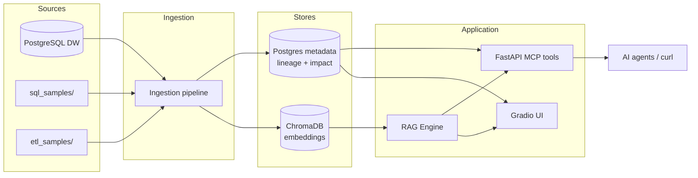

# Data Catalog Assistant — Portfolio showcase

One-page summary for resumes, LinkedIn, and interviews.

**GitHub:** [github.com/raghuram-chittibomma/data-catalog-assistant](https://github.com/raghuram-chittibomma/data-catalog-assistant) · **Profile:** [raghuram-chittibomma](https://github.com/raghuram-chittibomma)

---

## Problem

Data teams spend time hunting for tables, SQL, and ETL jobs, tracing lineage by hand, and guessing blast radius before schema changes. Spreadsheets and ad hoc queries do not scale.

## Solution

A **hybrid data intelligence POC**: semantic catalog search (vectors), deterministic lineage and change-impact (metadata graph), and **RAG-backed NL→SQL** (LLM only where generation is needed). Same capabilities are exposed via **Gradio** (demo UI) and **FastAPI MCP-style HTTP tools** (agent integration).

## Your story (customize)

| | |
|--|--|
| **Role** | Designed and built end-to-end POC (ingestion → catalog → API → UI) |
| **Scope** | PostgreSQL Northwind-style DW, file-based SQL/ETL samples, local embeddings, optional OpenAI for SQL gen |
| **Outcome** | Demo-ready catalog with search, lineage, impact analysis, and guarded SQL generation |

---

## Architecture (high level)

---

## Tech stack

| Layer | Technology | Role |
|-------|------------|------|
| Language | Python 3.10+ | Application and batch jobs |
| Data warehouse | PostgreSQL | Schema + sample Northwind data |
| Catalog / lineage | PostgreSQL (`bdw_rag_metadata`) | Assets, relationships, impact scores |
| Vector search | ChromaDB + sentence-transformers (`all-MiniLM-L6-v2`) | Semantic catalog search |
| LLM | OpenAI API (GPT-4) | NL→SQL with retrieved catalog context |
| API | FastAPI + Uvicorn | MCP-style tools on port 3000 |
| UI | Gradio 4.x | Demo tabs with LLM/embeddings legend |
| Batch | `run_refresh_job.py`, preflight script | Full catalog refresh |
| Quality | pytest (~95 tests) | Unit + integration-style tests |

---

## Design decisions (talking points)

1. **Two stores, two jobs** — Chroma for fuzzy discovery; Postgres for authoritative lineage and impact (not “vectors only”).
2. **LLM scoped to generation** — Search, lineage, validate, and impact use embeddings or metadata/rules so demos stay explainable and cheaper.
3. **RAG before SQL** — `QueryProcessor` pulls top-k catalog snippets into the LLM prompt; response includes `tables_used`.
4. **UI/MCP parity** — Shared `lineage_service` and `ImpactTools` so Gradio and HTTP tools stay aligned.
5. **Change impact resolver** — Proposed change text can name a different table than the Asset id field; analysis follows the change target.
6. **SQL safety** — Rule-based validator on generated SQL; blocked patterns for demo hardening.

---

## Scale (after a typical refresh)

| Metric | Typical value |
|--------|----------------|
| DW tables ingested | 14 (`public` schema) |
| SQL sample assets | 5 |
| ETL sample assets | 4 |
| Vector documents | 16 |
| Lineage relationships | 18 |
| Automated tests | 95 collected |

Numbers vary with config and samples; run `python batch_jobs/run_refresh_job.py` and check job output.

---

## What uses AI in the demo

| Feature | AI? |
|---------|-----|
| Catalog search | Embeddings only (Chroma) |
| Catalog browse, Lineage, Impact | Metadata graph — no LLM |
| Validate SQL | Rules — no LLM |
| Generate SQL | **LLM** + RAG context |

---

## Limitations (say these honestly)

- POC / single-tenant; no MCP auth or TLS in this repo.
- Catalog refresh is **manual CLI** (`run_refresh_job.py`); scheduler loop not enabled by default.
- Ingestion is DW schema + file-based SQL/ETL samples — not yet wired to live report/ETL servers.
- Catalog search uses **embeddings only**; other flows (lineage, impact) use metadata/rules, not LLM.
- Requires your own PostgreSQL DW and metadata DB (or `.env` hosts + `config/config.yaml`).

## Planned enhancements (production roadmap)

Good interview “what’s next” talking points — detail in [MAIN_PLAN.md](MAIN_PLAN.md) Phase 5:

| Area | Direction |
|------|-----------|
| **Security** | MCP auth, TLS, secret management |
| **Enterprise reporting** | Direct integration to an enterprise reporting platform to ingest report assets and lineage into the catalog |
| **ETL / report integration** | Incremental updates from ETL platforms (e.g. Informatica Workflow XML, Mapping XML, source/target definitions) |
| **Search** | LLM-backed NLP search for user-friendly catalog discovery (beyond Chroma similarity) |
| **RAG context** | Pull in matching report definitions and ETL/SQL text when answering or generating SQL |

---

## Links in this repo

| Doc | Purpose |
|-----|---------|
| [README.md](../README.md) | Install, run, architecture |
| [DEMO_SCRIPT.md](DEMO_SCRIPT.md) | 5-minute demo + Gradio/curl steps |
| [MAIN_PLAN.md](MAIN_PLAN.md) | Internal phase tracker |
| [ARCHITECTURE.md](ARCHITECTURE.md) | Deeper component notes |
| [MCP_DEMO.md](MCP_DEMO.md) | HTTP tool examples |
| [GITHUB_PUBLISH.md](GITHUB_PUBLISH.md) | Checklist to publish a clean GitHub repo |
| [images/README.md](images/README.md) | Screenshot capture guide |

---

## Resume bullet examples

Include the repo link: `https://github.com/raghuram-chittibomma/data-catalog-assistant`

- Designed and implemented a **RAG-based data catalog assistant** combining Chroma semantic search, PostgreSQL lineage metadata, and OpenAI NL→SQL with shared FastAPI MCP tools and Gradio UI.
- Built **ingestion pipeline** for warehouse schema, SQL files, and ETL YAML with automated refresh, impact scoring, and **95+ pytest** tests.

---

## 5-minute demo outline

See **[DEMO_SCRIPT.md](DEMO_SCRIPT.md)** — section *5-minute interview demo*.
